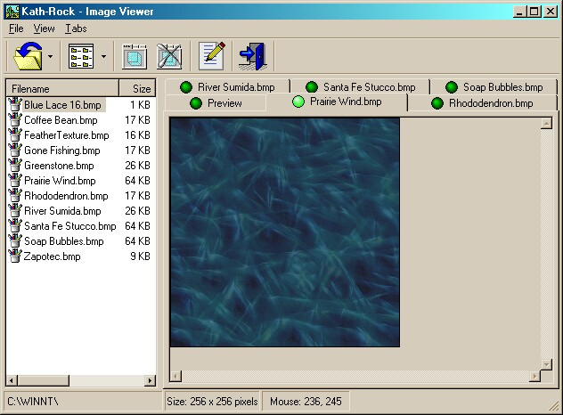



## \_Image Viewer

### Description

A great application for viewing entire folders of images. No limit to the number of images in the folder. Much better than a thumbnail viewer, this program shows each image at full size in a tab style design. Add and delete tabs for quick reference between images. This code also demonstrates the use of system ImageLists in a ListView. Features OLE drag and drop from Explorer. As an added bonus this application comes with the KRScroll scroll bar OCX (Sorry, no source code for the Kath-Rock KRScroll, but you can use it in your own apps, no license required. Note: Enough good votes may get you the KRScroll code next). Please view the ReadMe.txt file before opening the code in VB.

----

UPDATE 

----

Planet Source Code removed the KRScroll.ocx from the zip file. Please go to Kath-Rock.com to download the entire project with the ocx.
 
### More Info
 

             |
---                |---
**Submitted On**   |2001-11-21 07:38:26
**By**             |[Rocky Clark \(Kath\-Rock Software\)](https://github.com/Planet-Source-Code/PSCIndex/blob/master/ByAuthor/rocky-clark-kath-rock-software.md)
**Level**          |Advanced
**User Rating**    |4.4 (71 globes from 16 users)
**Compatibility**  |VB 6\.0
**Category**       |[Complete Applications](https://github.com/Planet-Source-Code/PSCIndex/blob/master/ByCategory/complete-applications__1-27.md)
**World**          |[Visual Basic](https://github.com/Planet-Source-Code/PSCIndex/blob/master/ByWorld/visual-basic.md)
**Archive File**   |[\_Image\_Vie3644111212001\.zip](https://github.com/Planet-Source-Code/rocky-clark-kath-rock-software-image-viewer__1-29062/archive/master.zip)

